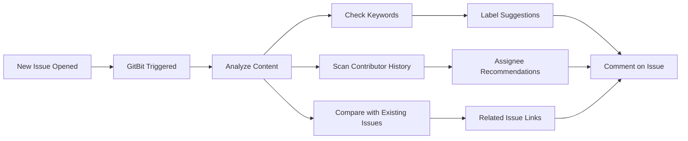

# GitBit 🤖

<div align="center">
  
  
  **Intelligent Issue Management Bot for GitHub**
  
  *A no-code, easy-to-install GitHub bot that automatically analyzes new issues to suggest labels, assignees, and related issues, saving maintainers valuable time.*

  [](https://github.com/LMLK-seal/GitBit/actions)
  [](https://github.com/LMLK-seal/GitBit/blob/main/LICENSE)
  [](https://github.com/marketplace/actions/gitbit-intelligent-issue-bot)
  [](https://github.com/LMLK-seal/GitBit/stargazers)

</div>

---

## 🌟 Overview

GitBit streamlines repository management by leveraging **Natural Language Processing (NLP)** to automate the tedious aspects of GitHub issue handling. Let our intelligent bot handle the triage while you focus on what matters most—building amazing software.

## ✨ Key Features

| Feature | Description | Benefit |
|---------|-------------|---------|
| 🏷️ **Smart Tagging** | Analyzes issue content to suggest relevant labels (`bug`, `documentation`, `feature-request`) | Ensures consistent categorization and improved searchability |
| 👤 **Assignee Recommendations** | Recommends contributors based on their expertise from previously closed issues | Distributes workload efficiently to the right team members |
| 🔗 **Automatic Issue Linking** | Scans and links semantically related or duplicate issues | Reduces clutter and centralizes related discussions |

## 🚀 Quick Installation

Get GitBit running in your repository in just **2 minutes** with these simple steps:

### 📋 Prerequisites

- GitHub repository with Issues enabled
- Repository admin access
- No coding experience required! 

### 🔧 Step 1: Create Workflow File

Create `.github/workflows/gitbit.yml` in your repository:

```yaml
name: GitBit Bot

on:
  issues:
    types: [opened]

jobs:
  run-gitbit:
    runs-on: ubuntu-latest
    permissions:
      issues: write
      contents: read
    steps:
      - name: Run GitBit Intelligent Issue Bot
        uses: LMLK-seal/GitBit@main
        with:
          github-token: ${{ secrets.GITHUB_TOKEN }}
```

### ⚙️ Step 2: Create Configuration File

Create `.gitbit.yml` in your repository root:

```yaml
# GitBit Configuration

# Smart Tagging: Map labels to trigger keywords
tag_keywords:
  bug:
    - error
    - exception
    - traceback
    - panic
    - crash
    - fail
    - broken
  documentation:
    - docs
    - readme
    - help
    - example
    - tutorial
    - guide
  feature-request:
    - feature
    - enhance
    - improvement
    - idea
    - suggestion
  performance:
    - slow
    - performance
    - optimization
    - speed
  security:
    - security
    - vulnerability
    - exploit
    - unsafe

# Assignee Recommendations: Analyze recent closed issues
assignee_rec:
  max_issues_to_scan: 100

# Issue Linking: Similarity threshold for related issues
issue_linking:
  similarity_threshold: 0.7
```

### ✅ Step 3: Activate

1. **Commit** both files to your repository
2. **Push** to your main branch
3. **Done!** GitBit will automatically analyze the next issue opened

## 📊 How It Works



GitBit operates as a **reusable GitHub Action**, meaning:
- 🔄 Always uses the latest version automatically
- 🛡️ No code duplication in your repository
- 📈 Continuous improvements without manual updates
- 🔒 Secure execution in GitHub's infrastructure

## 🎛️ Advanced Configuration

### Label Keywords Configuration

Customize `tag_keywords` to match your project's labeling system:

```yaml
tag_keywords:
  custom-label:
    - keyword1
    - keyword2
  priority-high:
    - urgent
    - critical
    - blocker
```

### Assignee Recommendation Tuning

Adjust `max_issues_to_scan` based on your repository size:
- **Small repos (< 100 issues)**: 50-100
- **Medium repos (100-1000 issues)**: 100-200  
- **Large repos (> 1000 issues)**: 200-500

### Issue Linking Sensitivity

Fine-tune `similarity_threshold`:
- **0.5-0.6**: More suggestions (higher recall)
- **0.7-0.8**: Balanced approach (recommended)
- **0.8-0.9**: Only very similar issues (higher precision)

## 📈 Benefits for Your Team

| Before GitBit | After GitBit |
|---------------|--------------|
| ⏰ Manual issue triage | 🤖 Automated suggestions |
| 🏷️ Inconsistent labeling | 📋 Standardized categorization |
| 👤 Random assignments | 🎯 Expertise-based matching |
| 🔍 Manual duplicate detection | 🔗 Automatic issue linking |
| 📊 Time-consuming maintenance | ⚡ Streamlined workflow |

## 🔧 Troubleshooting

<details>
<summary><strong>🚫 Bot not responding to new issues</strong></summary>

- Verify workflow file is in `.github/workflows/` directory
- Check that the workflow has `issues: write` permissions
- Ensure `.gitbit.yml` exists in repository root
- Check GitHub Actions tab for error messages
</details>

<details>
<summary><strong>🏷️ No label suggestions appearing</strong></summary>

- Review your `tag_keywords` configuration
- Ensure keywords match common terms in your issues
- Check if labels exist in your repository settings
- Verify keyword case sensitivity
</details>

<details>
<summary><strong>👤 No assignee recommendations</strong></summary>

- Ensure your repository has closed issues with assignees
- Increase `max_issues_to_scan` value
- Verify contributors have sufficient commit history
</details>

## 🤝 Contributing

We welcome contributions from the community! Here's how you can help:

### 🛠️ Development Setup

1. **Fork** the repository
2. **Clone** your fork locally
3. **Create** a feature branch
   ```bash
   git checkout -b feature/amazing-feature
   ```
4. **Make** your changes
5. **Test** thoroughly
6. **Commit** with descriptive messages
   ```bash
   git commit -m "✨ Add amazing feature"
   ```
7. **Push** to your branch
   ```bash
   git push origin feature/amazing-feature
   ```
8. **Open** a Pull Request

### 🐛 Reporting Issues

Found a bug? Have a feature request? 

1. Check existing issues first
2. Use our issue templates
3. Provide detailed reproduction steps
4. Include relevant configuration files

### 💡 Feature Requests

We love hearing your ideas! When suggesting features:
- Explain the use case
- Describe expected behavior  
- Consider implementation complexity
- Provide examples if possible

## 📋 Roadmap

- [ ] 🔍 **Advanced NLP Models**: Implement transformer-based classification
- [ ] 📊 **Analytics Dashboard**: Track bot performance and insights
- [ ] 🔄 **Custom Workflows**: Support for complex automation rules
- [ ] 🌐 **Multi-language Support**: Analyze issues in different languages
- [ ] 📱 **Slack/Discord Integration**: Notifications for team collaboration
- [ ] 🎯 **Priority Scoring**: Automatic priority assignment based on content

## 📊 Statistics

<div align="center">


</div>

## 📜 License

This project is licensed under the **MIT License** - see the [LICENSE](LICENSE) file for details.

## 🙏 Acknowledgments

- Built with ❤️ by the open-source community
- Powered by GitHub Actions
- NLP capabilities thanks to modern machine learning libraries
- Special thanks to all contributors and users

## 📞 Support

Need help? Here are your options:

- 📖 **Documentation**: Check this README and configuration examples
- 🐛 **Bug Reports**: [Open an issue](https://github.com/LMLK-seal/GitBit/issues/new)
- 💬 **Discussions**: [GitHub Discussions](https://github.com/LMLK-seal/GitBit/discussions)
- ⭐ **Feature Requests**: [Request a feature](https://github.com/LMLK-seal/GitBit/issues/new)

---

<div align="center">
  
**If GitBit helped streamline your workflow, consider giving us a ⭐!**

*Made with 🤖 by developers, for developers*

</div>
